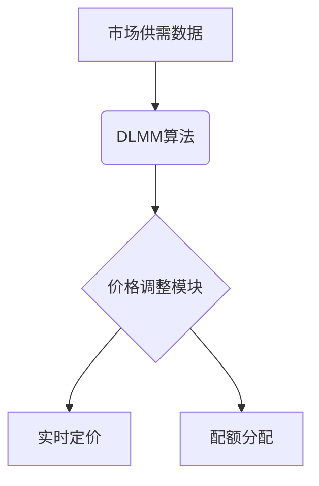

# Jupiter LFG Launchpad：Solana生态代币发行平台深度解析

## 什么是Jupiter LFG Launchpad？

Jupiter LFG Launchpad是Solana生态系统中首个采用动态流动性管理机制（DLMM）的代币发行平台。作为Jupiter生态的重要组成部分，该平台通过创新技术解决了传统Launchpad存在的价格暴跌、机器人操控和流动性不足等痛点，为项目方和投资者构建了高效透明的代币发行体系。

👉 [探索Jupiter交易平台](https://bit.ly/okx_welcome)

### 平台核心价值
- **技术突破**：DLMM算法实现动态价格调整
- **生态协同**：与Jupiter Exchange深度集成
- **市场地位**：截至2025年已启动78个项目，总锁仓量达12亿美元

## Solana生态的破局者

### 传统Launchpad的困境
| 问题类型       | 具体表现                  | 影响范围             |
|----------------|---------------------------|----------------------|
| 价格波动       | 固定价格导致抛售潮        | 项目方/投资者双输    |
| 机器人操控     | 超额代币囤积              | 分配不公             |
| 流动性不足     | 交易所整合度低            | 价格操纵风险         |

### Jupiter LFG的创新方案
- **动态定价机制**：通过数学模型实时匹配市场供需
- **智能风控系统**：AI驱动的风险评估框架
- **跨链流动性池**：支持多链资产无缝流转

## 技术架构详解

### DLMM算法运作原理
1. **参数输入**：筹资总额、代币总量、销售阶段等
2. **动态计算**：基于债券曲线的适应性调整
3. **输出结果**：实时优化价格与配额



### 技术增强亮点
- **隐私保护**：零知识证明技术应用
- **多链支持**：跨链桥接解决方案
- **AI预测**：项目可持续性评估模型

## 代币经济模型分析

### JUP代币核心数据
| 指标         | 当前值       | 年度变化  |
|--------------|-------------|----------|
| 市值         | ¥12.9B      | +28.98%  |
| 流通量       | 2.89B JUP   | +16.78%  |
| 市场占有率   | 0.11%       | 行业第59 |

### 分配机制
- 团队储备：20%
- 社区空投：40%
- 战略基金：20%
- 流动性支持：10%
- 早期贡献者：10%

👉 [了解代币经济体系](https://bit.ly/okx_welcome)

## 2025年市场表现

### 关键里程碑
- 用户基数突破78万
- 完成4项重大收购
- 实现28.98%市占率增长

### 性能指标
- 24小时交易量：¥59.3M
- 历史最高价：¥15.84
- 流动性池规模：¥44.53B

## 生态系统布局

### 2024-2025战略并购
1. **Ultimate Wallet**（2024.04）
   - 推出Jupiter Mobile
   - 移动端用户增长300%
   
2. **SolanaFM**（2024.09）
   - 链上数据分析能力提升
   - 交易追踪效率提高40%

3. **Sonarwatch**（2025.01）
   - 多链资产监控系统
   - 组合管理精度提升

## 市场影响评估

### 成功案例
- AI基础设施项目：6个月市值增长29倍
- 游戏生态代币：3个月用户突破百万
- RWA DeFi协议：与3家金融机构达成合作

### 行业对比
| 维度         | Jupiter LFG | 竞品A     | 竞品B     |
|--------------|-------------|-----------|-----------|
| 启动项目数   | 78          | 52        | 65        |
| 流动性规模   | ¥44.53B     | ¥32.8B    | ¥38.1B    |
| 技术专利     | 12项        | 7项       | 9项       |

## 价格预测与投资策略

### 短期走势（2025）
| 指标     | 预测值       | 波动区间     |
|----------|-------------|-------------|
| 平均价   | ¥4.42       | ¥3.62-¥5.48 |
| 涨幅潜力 | +16.78%     | 最高+297%   |

### 长期展望（2025-2035）
```mermaid
lineChart
    title Jupiter价格趋势预测
    x-axis 年份
    series "价格区间" [¥3.62,¥5.48,¥7.38,¥9.83,¥12.22,¥24.62]
```

## 常见问题解答（FAQ）

### Q1：Jupiter LFG如何保证代币发行公平性？
A：通过DLMM算法动态调整价格机制，结合零知识证明技术确保交易透明，有效防止机器人操控。

### Q2：JUP代币的经济模型有何优势？
A：采用通缩模型设计，2025年通胀率降至3.8%，结合质押锁仓机制形成双重价值支撑。

### Q3：平台如何应对监管挑战？
A：已建立合规框架，实施KYC验证流程，同时保持去中心化特性，平衡监管要求与用户体验。

### Q4：跨链整合进展如何？
A：已完成与以太坊、Polygon的桥接开发，2025年Q3将支持Cosmos生态，流动性池规模预计增长50%。

### Q5：投资者参与门槛多高？
A：支持USDC/SOL/JUP多币种投资，最低参与金额仅需$100，提供阶梯式锁仓奖励机制。

👉 [立即参与代币发行](https://bit.ly/okx_welcome)

## 风险与机遇

### 系统性风险
- **技术层面**：Solana网络稳定性依赖
- **监管层面**：SEC对DEX的审查动态
- **市场层面**：加密货币整体波动周期

### 突破方向
1. 法币入金通道拓展
2. 机构投资者准入机制
3. DeFi衍生品开发

## 投资者策略建议

### 组合配置
- 基础仓位：3%-5%
- 波段操作：5%-10%
- 长期持有：10%-15%

### 风险控制
- 止损线：¥3.76（历史支撑位）
- 加仓区间：¥3.62-¥4.13
- 目标收益：2025年预期回报率89-297%

## 行业前景展望

### 技术演进
- 2025Q3：推出零知识证明3.0版本
- 2025Q4：跨链TVL突破$100B
- 2026：启动Jupnet全链网络

### 市场预测
- 保守估值：$1.4/代币
- 乐观预期：$3.0/代币
- 极端牛市：$5.0/代币

## 结语

作为Solana生态的核心基础设施，Jupiter LFG Launchpad通过技术创新重构了代币发行逻辑。其DLMM算法不仅解决了行业痛点，更为DeFi发展提供了新范式。随着全链网络Jupnet的推进和跨链生态的扩展，平台正在重塑加密货币发行市场的价值逻辑。投资者在关注JUP代币短期波动的同时，更应重视其作为生态入口的长期战略价值。