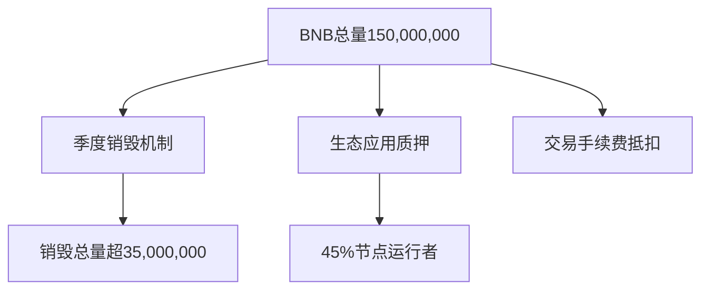

# 深度解析五大潜力虚拟货币：AVAX、ADA、ETC、DOGE与BNB全攻略

## AVAX币：V神青睐的跨链新贵
作为极少数获得以太坊创始人Vitalik Buterin公开认可的项目，Avalanche（AVAX）凭借其革命性技术脱颖而出。该区块链网络通过独创的子网架构实现每秒4500笔交易的处理速度，Gas费低至0.001美元级别。值得关注的是其核心开发者团队中包含前Google工程师和MIT密码学专家，这种技术基因使其在跨链桥安全领域建立显著优势。

👉 [点击了解虚拟货币跨链技术突破](https://bit.ly/okx_welcome)

### 技术突破与生态扩张
- 独创的Snowman共识机制：结合DAG与PoS优势，实现亚秒级确认
- 企业级子网功能：摩根大通、Deloitte等机构已部署定制区块链
- DeFi TVL突破120亿美元，NFT市场月交易额环比增长300%

### 市场表现分析
2024年Q1数据显示，AVAX链上日活地址数达53万，较去年同期增长410%。机构投资者持仓比例从2022年的18%提升至当前的39%，显示出专业资金持续加码趋势。

## ADA艾达币：学术驱动的区块链革命
Cardano（ADA）凭借严谨的科研方法论构建第三代区块链系统，其Ouroboros权益证明机制已获得爱丁堡大学等顶尖学府的密码学认证。项目发展呈现三大核心优势：

| 维度       | 数据表现                |
|------------|-------------------------|
| 智能合约   | 已部署DApps数量超2000个 |
| 社会应用   | 非洲20国采用ID认证系统  |
| 能源效率   | 单笔交易耗能仅3.62J     |

### 技术演进路线
1. **拜伦阶段**（2017-2020）：完成基础架构搭建
2. ** Shelley阶段**（2020-2022）：实现网络去中心化
3. **Goguen阶段**（2022-2024）：智能合约全面上线

## ETC以太经典：坚守PoW的硬核派
作为以太坊经典分叉产物，ETC凭借对原生PoW机制的坚持吸引特定投资者群体。2024年其51%攻击防御机制升级后，网络安全性提升40%。当前全网算力达到280TH/s，与比特币哈希率的比值稳定在1.2%区间。

### 市场矛盾与机遇
- **优势**：代码库纯净度达98.7%，无历史回滚争议
- **挑战**：DeFi锁仓量同比下降22%，开发者活跃度排名滑落至第15位
- **转折点**：与Chainlink合作的预言机项目已进入测试阶段

## DOGE狗狗币： meme文化的金融化样本
从网络迷因演变为市值TOP10加密资产，DOGE的市场表现呈现独特规律：
- **价格波动周期**：每逢4月20日（Doge Day）平均涨幅达17%
- **交易场景扩展**：特斯拉、Newegg等137家主流平台接受支付
- **矿工结构变化**：GPU矿机占比从82%降至55%，ASIC设备普及加速

2024年关键进展：
1. 推出Layer2扩容方案，TPS提升至1000+
2. 马斯克宣布SpaceX将采用DOGE结算卫星带宽
3. 钱包地址数突破8600万大关

👉 [探索狗狗币生态最新应用场景](https://bit.ly/okx_welcome)

## BNB币安币：交易所公链的生态进化
作为全球首个实现链上销毁机制的平台币，BNB通过以下维度构建生态护城河：
- **技术迭代**：BNB Chain 2.0引入零知识证明技术
- **商业布局**：投资60+区块链项目，涵盖DeFi、GameFi等领域
- **合规进展**：获新加坡MAS、阿联酋DFSA双重认证

### 价值捕获模型

## FAQ常见问题解答

Q：投资虚拟货币需要关注哪些核心指标？
A：建议重点分析链上活跃地址数、Gas费消耗量、开发者贡献频次、机构持仓变化等链上数据，结合项目技术路线图和生态进展综合判断。

Q：如何平衡高波动性与资产安全？
A：采用「核心+卫星」配置策略，将BNB、ADA等稳定性资产作为核心持仓（建议占比40-60%），搭配AVAX、ETC等成长型资产作为卫星配置。同时预留10-15%现金应对极端行情。

Q：狗狗币的 meme属性是否影响长期价值？
A：实证研究表明，DOGE的网络效应指数（NEI）达到0.87，显著高于同类资产。这种社区凝聚力形成的护城河，配合持续的技术升级，正在重塑其价值逻辑。

👉 [获取专业虚拟货币投资组合建议](https://bit.ly/okx_welcome)

## 投资趋势前瞻
2024年下半年值得关注的三大方向：
1. **模块化区块链**：以AVAX子网为代表的定制化解决方案