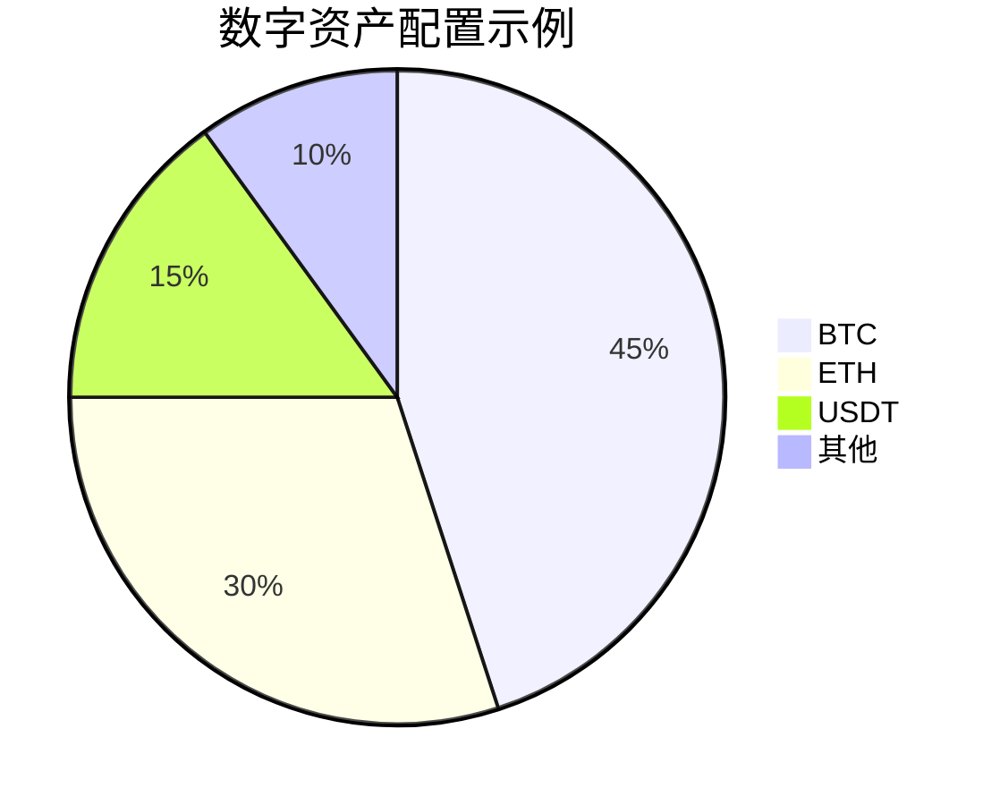

# USDT兑换CAD指南：稳定币使用与汇率计算全解析

## USDT基础认知
泰达币（USDT）作为锚定美元的稳定加密货币，其核心价值在于通过区块链技术实现数字美元的便捷流通。该币种由Tether Limited公司发行，采用1:1美元储备的信用背书机制，为全球加密货币市场提供重要流动性支撑。

### 稳定币市场定位
在加密货币剧烈波动的市场环境中，USDT凭借价格稳定性成为：
- 数字资产交易的避险工具
- 法币与加密货币的中转桥梁
- 增强交易所资金流转效率的解决方案

> **核心优势**：即时结算能力+零链上手续费+多平台兼容性

## USDT与CAD兑换实务
### 兑换渠道选择
用户可通过以下方式实现USDT与加拿大元（CAD）的双向转换：

| 渠道类型       | 典型代表          | 兑换特点                  |
|----------------|-------------------|---------------------------|
| 中心化交易所   | OKX、Bybit        | 实时汇率/高流动性/手续费透明 |
| 去中心化平台   | Curve Finance     | 无需KYC/跨链兑换          |
| OTC场外市场    | 专业做市商        | 大额交易/定制汇率         |

👉 [立即体验USDT与CAD实时兑换](https://bit.ly/okx_welcome)

### 兑换成本解析
实际交易中需注意三重费用：
1. **区块链手续费**：网络拥堵时可能升至$5-10
2. **平台服务费**：主流交易所约0.1%-0.5%
3. **汇差成本**：实时报价与市场价格存在0.3%-1%浮动

## 技术运作机制
### 双层架构体系
Tether采用分层技术方案：
- **底层协议**：基于Omni Layer协议构建价值传输网络
- **应用层**：支持TRC20、ERC20等多链部署

### 储备审计争议
尽管官方宣称100%美元储备，但市场持续关注：
- 审计透明度问题
- 法律管辖区合规风险
- 储备资产构成比例

## 市场应用场景
### 跨境支付革新
USDT在国际贸易结算中的应用优势：
- 7×24小时实时到账
- 汇率锁定避免波动风险
- 跨境手续费降低80%

### 数字资产配置
投资者通过USDT构建投资组合：

👉 [掌握专业资产配置策略](https://bit.ly/okx_welcome)

## 风险管理指南
### 钱包安全建议
- 热钱包单日限额控制在$5000以内
- 冷钱包存储大额资产
- 定期更换API密钥

### 政策合规要点
加拿大金融监管局（OSFI）最新指引：
- 要求交易所储备证明披露
- 交易记录保存期限延长至7年
- 反洗钱（AML）审查升级

## 常见问题解答（FAQ）

### USDT兑换CAD是否需要实名认证？
主要平台普遍要求KYC验证，但部分OTC市场提供$1000以下免认证交易额度。

### 实时汇率如何获取？
可通过CoinMarketCap、CoinGecko等专业平台查看USDT/CAD最新报价，交易所交易界面也提供实时行情。

### 资金到账需要多久？
链上确认时间约10-30分钟，交易所内转换可实现秒级到账。

### 如何选择交易平台？
建议优先考虑：合规资质、交易深度、手续费结构、客户服务响应速度等核心要素。

👉 [获取全球合规交易平台清单](https://bit.ly/okx_welcome)

## 未来发展趋势
### 监管科技（RegTech）融合
预计2025年将出现：
- 智能合约自动合规验证
- 实时储备透明化展示
- 跨境支付合规通道标准化

### 多币种锚定拓展
Tether计划新增更多法币锚定：
- 加元（CAD）
- 澳元（AUD）
- 新加坡元（SGD）

通过系统化的认知框架与操作指南，用户可安全高效地运用USDT进行跨境资金管理与数字资产配置。建议持续关注官方公告与市场动态，及时调整风险管理策略。