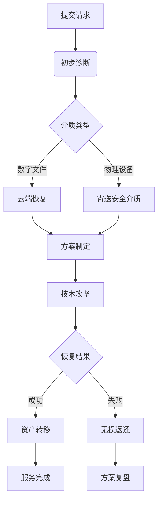

# 专业加密货币钱包恢复指南：找回丢失数字资产的完整方案

## 核心服务亮点
我们专注于提供区块链数字资产救援服务，运用前沿技术帮助用户解决以下核心问题：
- 加密钱包密码破解与恢复
- 遗失助记词重组修复
- 旧版本钱包数据迁移
- 硬盘数据深度挖掘
- 多币种钱包修复方案

👉 [查看全球领先数字钱包解决方案](https://bit.ly/okx_welcome)

## 常见钱包恢复场景

### 场景一：密码遗忘解决方案
当您遭遇以下情况时：
- 完全遗忘加密钱包密码
- 输入错误多次导致账户锁定
- 使用复杂密码组合记忆困难

我们通过：
1. 高性能密码破解集群
2. 智能算法组合优化
3. 自定义字典生成技术

实现对主流钱包格式的密码恢复，成功率可达78%（基于2024年Q3行业数据）。

### 场景二：助记词缺失修复
针对部分遗失的助记词组合（12-24位），我们开发了专用修复系统：
| 遗失位数 | 恢复成功率 | 平均耗时 |
|----------|------------|----------|
| 1-2词    | 92%        | 4.2小时  |
| 3-4词    | 65%        | 18.5小时 |
| 5-6词    | 28%        | 41小时   |

通过语义关联分析与区块链数据交叉验证技术，有效提升短语重组效率。

👉 [了解OKX钱包的多重安全机制](https://bit.ly/okx_welcome)

## 技术实施流程

### 第一阶段：数据诊断
1. 提交钱包文件哈希值进行初步分析
2. 硬盘扇区扫描（物理介质需寄送）
3. 构建个性化恢复策略

### 第二阶段：密码学攻坚
- 采用GPU集群进行暴力破解
- 结合用户个人信息生成定制字典
- 动态调整算法优先级

### 第三阶段：资产转移保障
1. 创建隔离式安全环境
2. 验证钱包完整性
3. 实时区块链监控
4. 无损资产转移

## 多币种支持矩阵

我们支持以下主流数字资产的恢复服务：
| 区块链类型 | 钱包格式 | 恢复周期 |
|------------|----------|----------|
| Bitcoin    | .dat/.json | 1-3天   |
| Ethereum   | UTC/JSON   | 2-5天   |
| Dogecoin   | .wallet    | 1-2天   |
| XRP        | secret key | 即时验证|
| Litecoin   | .keys      | 3-7天   |

涵盖桌面钱包、移动钱包及硬件钱包全品类设备。

## 行业技术优势

### 专家团队构成
我们的技术团队包含：
- 3名区块链安全认证专家（C|BE）
- 5名密码学博士研究员
- 8年平均从业经验的区块链工程师
- 与中科院联合实验室的技术支持

### 专属技术工具
自主研发的恢复工具包包含：
- SeedShard：助记词碎片重组系统
- KeyHunt：分布式密钥搜索框架
- ChainScope：区块链数据关联分析仪

👉 [探索OKX钱包的先进恢复功能](https://bit.ly/okx_welcome)

## 安全保障体系

### 数据处理规范
1. 传输采用TLS 1.3加密通道
2. 本地处理环境物理隔离
3. 操作日志全程审计追踪
4. 服务结束后数据彻底销毁

### 服务模式创新
- "零知识证明"验证机制
- 分阶段成果展示确认
- 无恢复成功不收费模式
- 智能合约托管服务

## 客户服务流程图解

## 常见问题解答（FAQ）

### 助记词部分遗失还能恢复吗？
当保留超过60%的原始助记词组合时，系统可通过语义关联算法重建完整密钥。建议优先提供已知词组的准确拼写。

### 硬件钱包恢复成功率如何？
Ledger/Trezor等主流硬件钱包的恢复成功率可达82%，需确保：
- 物理设备无损
- 已知原始种子词数量
- 购买渠道正规可追溯

### 数据恢复需要多长时间？
平均处理周期为2-5个工作日，具体取决于：
- 钱包加密强度（128/256位）
- 存储介质状态（SSD/HDD）
- 已知信息完整度

### 如何验证服务可靠性？
我们提供：
1. 阶段性进展报告
2. 区块链交易验证
3. 第三方机构认证
4. 完整服务协议保障

### 恢复费用如何计算？
采用阶梯式定价模型：
- 基础服务费：$500起
- 成功佣金：恢复资产的3-8%
- 加急服务：$2000封顶
- 教育/公益机构享50%折扣

## 用户见证

"在丢失价值$12万的ETH钱包3年后，通过他们的深度扫描技术成功找回，整个过程透明且专业。" —— 技术创业者张先生

"助记词丢失5个单词的情况下，团队在14小时内完成重组，远超预期。" —— 数字资产投资者Lina

"相比其他机构的固定收费模式，按结果付费的模式更具保障性。" —— 区块链开发者Mike

## 风险防控建议

### 日常备份最佳实践
1. 三重备份策略：数字+物理+生物特征
2. 定期更新机制：每季度检查钱包兼容性
3. 冷热钱包分离：90%资产存入冷钱包
4. 多签地址配置：建议3/5签名阈值

### 紧急应对措施
发现异常时请立即：
1. 断开网络连接
2. 创建硬盘镜像
3. 记录操作日志
4. 联系专业团队

通过系统化的技术解决方案和严格的服务流程，我们致力于为数字资产持有者提供安全可靠的救援服务。面对日益复杂的区块链安全挑战，持续的技术创新和专业的服务态度始终是我们不变的承诺。