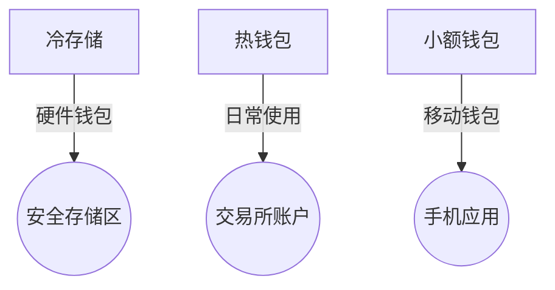

# 比特币钱包丢失了？这份指南帮你找回数字资产

## 比特币钱包丢失的现状与影响

在加密货币领域，比特币钱包丢失是一个不可忽视的现象。据区块链分析公司Chainalysis统计，目前约有20%的流通比特币处于不可访问状态，这些数字资产或因私钥丢失、钱包故障或用户疏忽而永远沉寂在区块链上。这种现象不仅影响个人资产安全，还可能对市场供需关系产生深远影响——每丢失一个比特币，现存流通量就减少一个单位，这种天然的稀缺性可能成为推高币价的潜在因素。

### 丢失比特币的常见场景
| 场景类型        | 典型案例                  | 资产规模       |
|----------------|-------------------------|--------------|
| 硬盘丢失        | 英国程序员硬盘埋入垃圾场    | 7500 BTC     |
| 密码遗忘        | 德国开发者IronKey设备锁定  | 7002 BTC     |
| 平台倒闭        | Mt.Gox交易所破产事件       | 85万 BTC     |
| 继承问题        | 加拿大QuadrigaCX创始人去世 | 1.9亿加元    |

👉 [专业数字资产存储方案](https://bit.ly/okx_welcome)

## 比特币钱包恢复操作指南

### 第一步：确认钱包类型与存储路径
比特币存储方式直接影响恢复策略：
1. **硬件钱包**：需核对设备型号及备份助记词
2. **软件钱包**：检查设备存储路径（Windows系统路径：%APPDATA%/Bitcoin）
3. **交易所钱包**：登录对应平台账户查看交易记录
4. **纸质钱包**：查找物理存储位置（建议使用区块链浏览器验证地址有效性）

### 第二步：针对性恢复方案
#### 纸质钱包恢复
- 检查防火保险箱等安全存储处
- 使用文档扫描仪搜索"wallet.dat"文件
- 通过区块链浏览器验证公钥地址

#### 交易所钱包恢复
1. 检索邮箱中的账户验证邮件
2. 使用平台官方找回功能（如Coinbase账户恢复）
3. 联系客服提供身份证明文件

#### 软件钱包数据恢复
- 使用Recuva、TestDisk等专业工具扫描存储设备
- 检查云备份（如Google Drive、iCloud）
- 尝试旧设备的数据恢复服务

### 第三步：技术辅助恢复
#### 私钥恢复工具
| 工具名称         | 支持系统     | 恢复成功率 | 使用难度 |
|------------------|-------------|------------|----------|
| Bitcoin Core     | Windows/Mac | ★★★★☆      | 中等     |
| Electrum Wallet  | 全平台      | ★★★★★      | 简单     |
| Wallet Recovery  | 在线工具    | ★★★☆☆      | 简单     |

👉 [获取专业数据恢复服务](https://bit.ly/okx_welcome)

## 保障数字资产安全的六大原则

### 1. 多重备份策略
- **物理备份**：使用钛合金铭牌刻录助记词（推荐Billfodl方案）
- **数字备份**：加密存储至多个云盘（建议使用Veracrypt加密容器）
- **生物备份**：记忆法（如BIP39助记词关联记忆法）

### 2. 分级存储体系

### 3. 安全防护措施
- 定期更新防病毒软件（推荐Bitdefender）
- 启用双重认证（推荐YubiKey硬件令牌）
- 交易地址轮换（避免重复使用同一地址）

### 4. 遗产规划方案
- 创建数字遗产清单（包含钱包位置、密码提示等）
- 使用Dead Man's Switch智能合约
- 指定可信执行人（建议3人以上共同管理）

### 5. 持续监控机制
- 设置地址变动提醒（Blockchair提供邮件通知功能）
- 定期核对钱包余额（建议每周一次）
- 监控异常登录记录（启用异地登录警报）

### 6. 教育储备计划
- 学习BIP32/BIP39标准协议
- 参加区块链安全认证课程（如C4认证）
- 加入专业社群获取最新安全资讯

## 常见问题解答

Q: 如何快速确认钱包是否包含比特币？
A: 使用区块链浏览器（如blockchair.com），输入钱包地址即可查看余额及交易记录。建议同时使用多个平台交叉验证。

Q: 恢复过程中遇到硬件损坏怎么办？
A: 可联系专业数据恢复机构（如DriveSavers），或使用专业工具尝试芯片级数据提取（需具备电子工程知识）。

Q: 密码遗忘是否还有恢复可能？
A: 可尝试密码破解工具（如Bitcoin Password Tool），但成功率取决于密码复杂度。建议优先找回纸质备份或助记词。

Q: 如何防范钱包被盗？
A: 采用分层安全策略：冷热钱包分离、多重签名、定期更换密钥。推荐使用硬件钱包配合生物识别技术。

Q: 丢失助记词还能恢复钱包吗？
A: 若未备份私钥且无法找回助记词，钱包将永久锁定。建议立即停止使用该地址，转移剩余资产至新钱包。

Q: 数字遗产如何合法继承？
A: 可通过智能合约设置继承规则，或在遗嘱中明确数字资产分配。建议咨询专业区块链法律顾问。

## 未解之谜与行业启示

### 五大离奇丢失事件
1. **中本聪的百万比特币**：创世区块持有者至今未动用110万BTC
2. **Mt.Gox交易所之谜**：85万比特币消失引发行业信任危机
3. **垃圾场里的金矿**：英国程序员为找回硬盘支付200万英镑打捞费
4. **密码困局**：德国开发者被困7002 BTC价值超2亿美元
5. **CEO的死亡密码**：加拿大交易所负责人离世致1.9亿加元冻结

这些真实案例揭示：数字资产管理需要超越传统思维的系统化解决方案。建议采用"3-2-1"存储原则——三个备份、两种介质、一处异地存储，最大限度降低丢失风险。

👉 [获取定制化资产保护方案](https://bit.ly/okx_welcome)

## 未来展望与技术创新

随着量子计算和AI技术的发展，比特币安全体系面临新挑战：
- **量子抗性钱包**：采用格密码学（Lattice-based Cryptography）的新一代钱包正在研发
- **AI辅助恢复**：深度学习算法可提升数据碎片重组效率
- **分布式密钥管理**：Shamir秘密共享方案的商业化应用
- **监管科技（RegTech）**：智能合约自动执行合规性检查

行业专家预测，到2025年数字资产保险市场规模将突破500亿美元，这将推动钱包安全技术的进一步升级。建议投资者持续关注区块链安全技术发展，适时更新存储方案。
